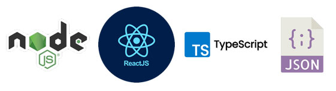
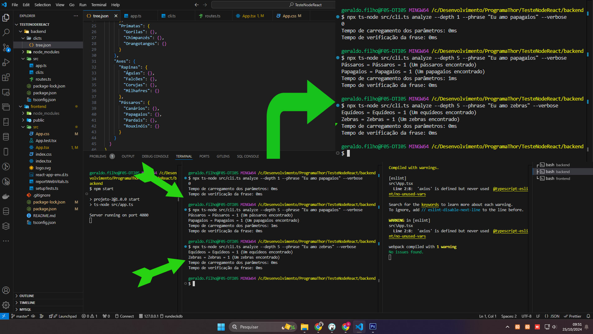
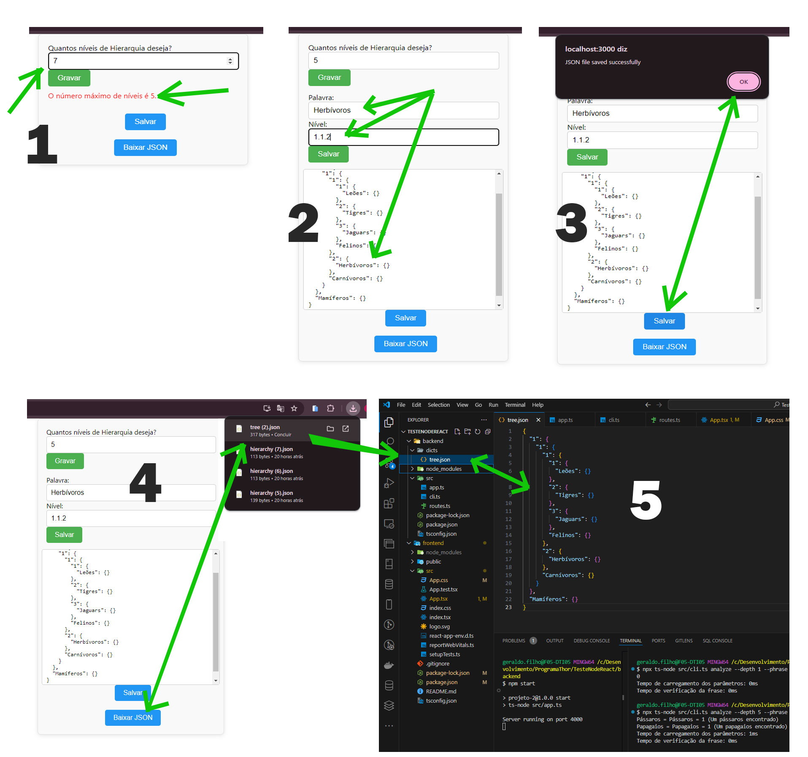

<p align="center">
  
</p>

## Objetivo e detalhes do Projeto
```bash
Analisador de Hierarquia de Palavras
1 - Analisa via console a hierarquia e niveis, mostrando a quantidade e nivel
    encontrado da palavra no backend.
2 - Informa a quantidade de niveis desejados no front, montando o json com base
    na palavra e nível.
3 - Salva o Json montado no backend.
4 - Executa o download do arquivo json gerado.
```

## Instalação e uso
```bash
Entre na pasta backend e execute os comando:

$ npm install 
$ npm start

Mesmo processo para o frontend
O backend está para executar na porta 4000 e o front na 3000


Para testes iniciais no backend...
o projeto era pra ser usado o Bun, fiz uma aderencia para windows no nodejs usando o npx ts-node.
de:
$ bun run cli.ts analyze --depth 2 "Eu amo papagaios" --verbose
para: 
$ npx ts-node src/cli.ts analyze --depth 5 --phrase "Eu amo papagaios" --verbose

As rotas criadas são:
Para salvar o json no backend:
http://localhost:4000/save-json

Para fazer o download:
http://localhost:4000/download-json

```

## Telas funcionais
## Backend - Testes Executados


## Frontend - Teste Realizado


## Video Demo
[](https://youtu.be/m5abKpHU7sk)
